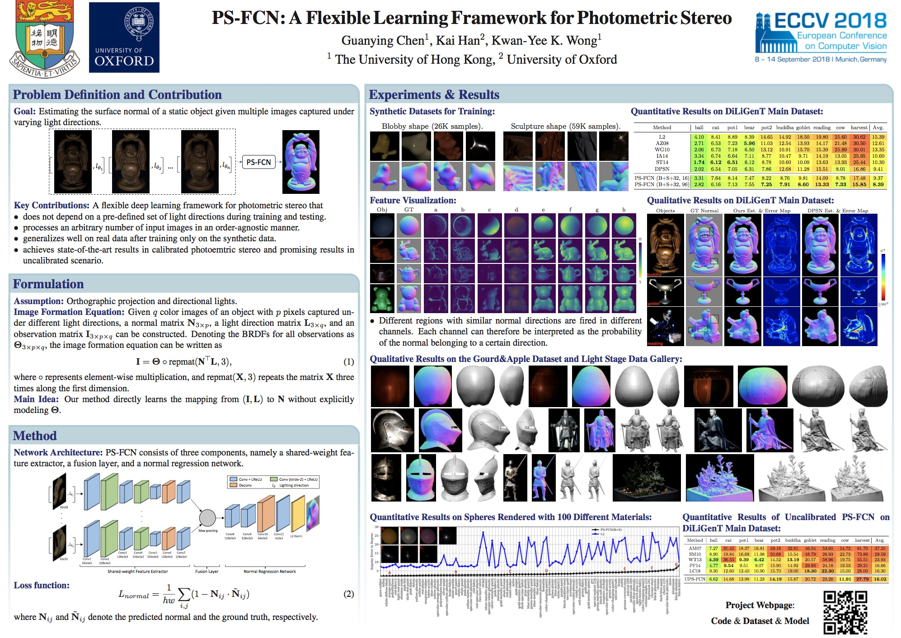
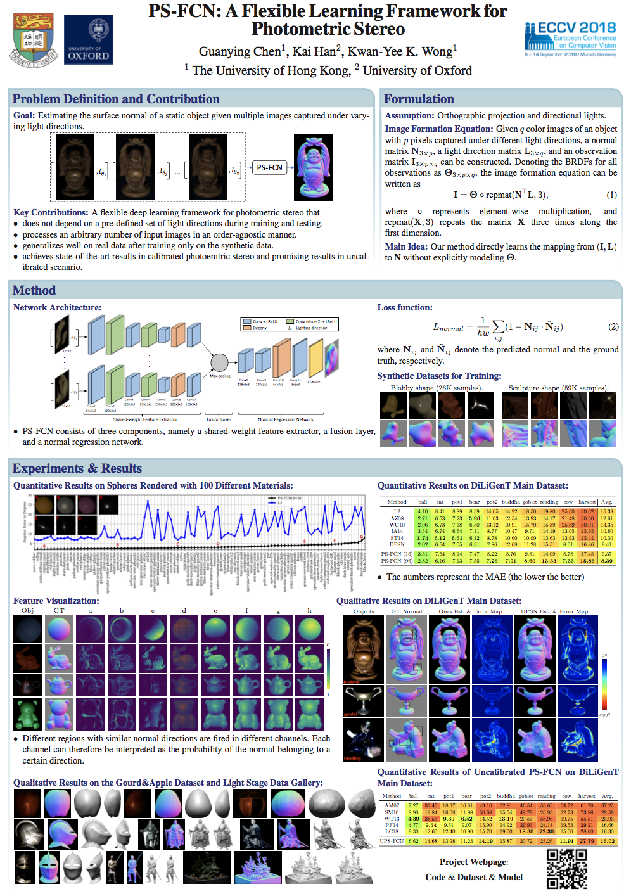

# LaTex Poster for PS-FCN (ECCV 2018)

## Poster Examples
### Landscape Format

    

### Portrait Format

    

## Introduction
This code stores the LaTex source code for building the poster for PS-FCN (ECCV 2018). This poster is based on the amazing [LaTex Poster Template](http://www.brian-amberg.de/uni/poster/). You may try to design your own poster based on this example. Please refer to (http://www.brian-amberg.de/uni/poster/) for more examples and FAQ.

We provide poster examples in both the landscape and portrait format.

- Open [poster_landscape.pdf](./poster_landscape.pdf) or [poster_portrait.pdf](./poster_portrait.pdf) to see the built poster.

- Type `make landscape` or `make portrait` to rebuild the poster.

## More LaTex Poster Examples
- [TOM-Net: Learning Transparent Object Matting from a Single Image (CVPR 2018)](https://github.com/guanyingc/TOM-Net_Poster_LaTex)
